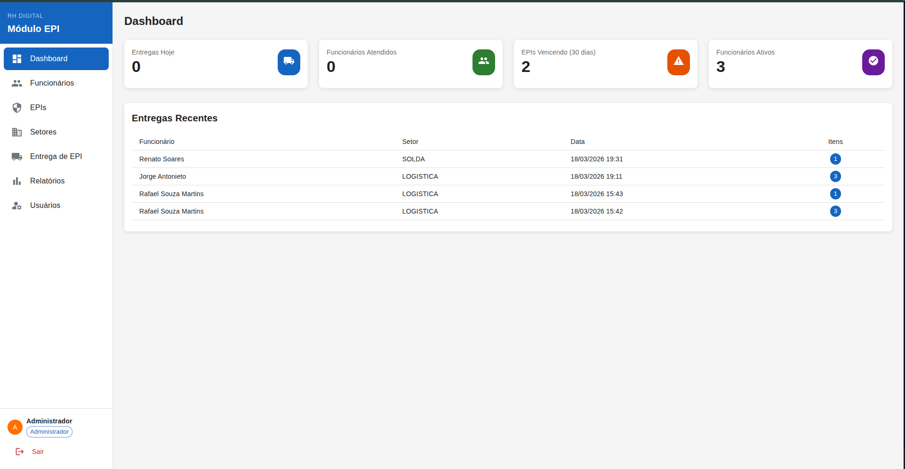
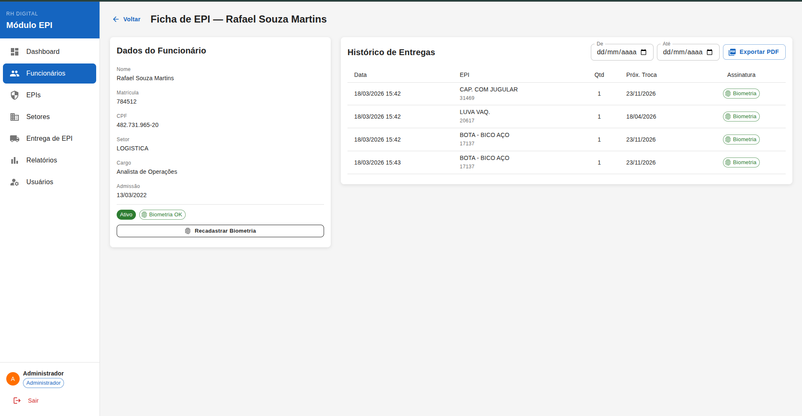
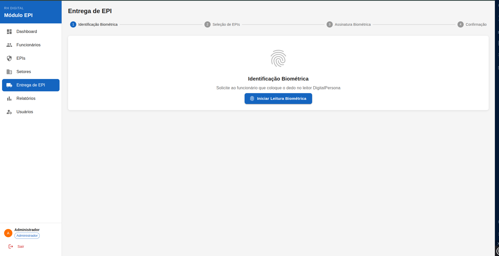
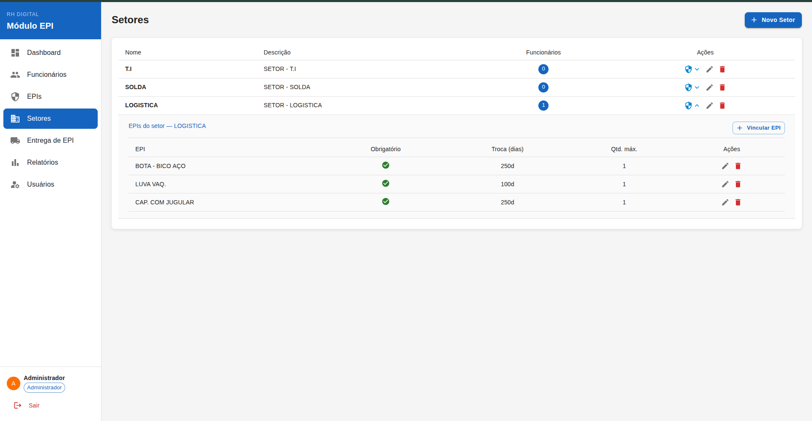
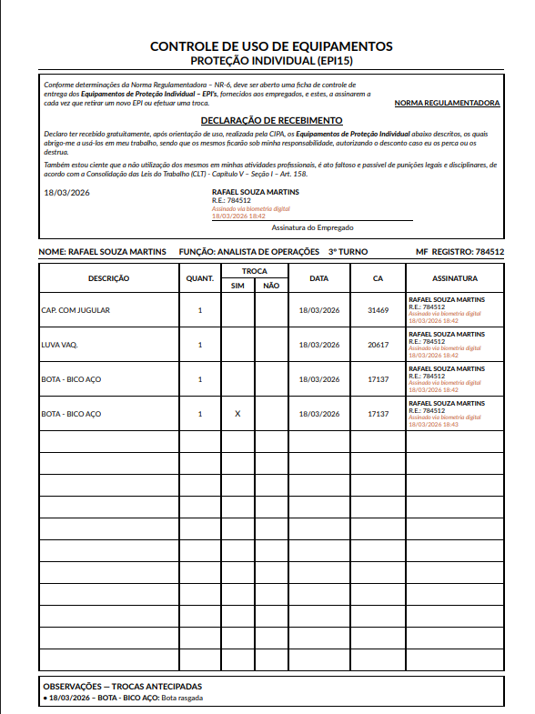

# Digital RH — Sistema de Gestão Eletrônica de EPI

Sistema corporativo completo para controle de entrega e assinatura eletrônica de **Equipamentos de Proteção Individual (EPI)**, com identificação biométrica via DigitalPersona U.are.U, geração de ficha EPI15 em PDF e alertas automáticos por e-mail para encarregados de setor.

---

## Funcionalidades

- **Identificacao biometrica 1:N** — funcionario identificado pela digital no leitor DigitalPersona (libfprint no Linux, SDK nativo no Windows)
- **Fluxo de entrega guiado** — identificacao, selecao de EPIs sugeridos pelo setor, assinatura biometrica e confirmacao em 4 passos
- **Ficha EPI15 em PDF** — gerada automaticamente no padrao NR-6, com assinatura biometrica impressa por linha e no termo de recebimento
- **Troca antecipada com justificativa** — registro de motivo por item EPI
- **Alertas de vencimento por e-mail** — job diario que envia relatorio de EPIs vencidos ao encarregado de cada setor via SMTP (Locaweb ou qualquer servidor)
- **Painel de pendencias** — visao do almoxarifado com todos os funcionarios com EPI vencido e sem troca registrada
- **Gestao de setores** — vinculacao de EPIs obrigatorios por setor com periodo de troca e quantidade maxima
- **Multiusuario com perfis** — Administrador, RH e Almoxarifado com controle de acesso por rota
- **Cadastro completo de funcionarios** — nome, CPF, matricula, setor, funcao, turno, admissao, foto e biometria
- **Relatorios exportaveis em PDF**

---

## Screenshots

### Dashboard
Visão geral com indicadores do dia: total de entregas realizadas, funcionários atendidos e EPIs com vencimento próximo. Permite monitorar a operação em tempo real.



---

### Funcionários
Cadastro completo com foto, turno, setor, função e status. Cada funcionário tem histórico de entregas vinculado e biometria cadastrada para identificação no almoxarifado.



---

### Entrega de EPI
Fluxo guiado em 4 etapas: identificação biométrica do funcionário, seleção dos EPIs (com sugestão automática pelo setor), assinatura biométrica e confirmação. Suporta troca antecipada com justificativa por item.



---

### Setores
Gerenciamento de setores com EPIs obrigatórios vinculados, período de troca, quantidade máxima e encarregado responsável para recebimento de alertas por e-mail.



---

### Ficha EPI15 (PDF)
Ficha gerada automaticamente no padrão NR-6 com termo de declaração de recebimento, assinatura biométrica impressa por linha da tabela e histórico completo de entregas do funcionário.



---

## Stack

| Camada | Tecnologia |
|---|---|
| Backend | C# .NET 8 / ASP.NET Core Web API |
| Arquitetura | Clean Architecture (Domain / Application / Infrastructure / API) |
| Frontend | React 18 + TypeScript + Vite |
| Banco de Dados | PostgreSQL 16 |
| ORM | Entity Framework Core 8 (migrations manuais) |
| Autenticacao | JWT Bearer |
| Biometria (Linux) | Python 3 + libfprint-2 via GObject Introspection (bridge WebSocket) |
| Biometria (Windows) | DigitalPersona One Touch SDK |
| UI | Material UI v5 |
| Estado | React Query + Zustand |
| PDF | QuestPDF |
| E-mail | MailKit (SMTP) |
| Infra | Docker + Docker Compose |

---

## Arquitetura

```
digital-rh/
├── backend/
│   └── src/
│       ├── EpiManagement.Domain/         # Entidades, interfaces, enums
│       ├── EpiManagement.Application/    # Services, DTOs, casos de uso
│       ├── EpiManagement.Infrastructure/ # EF Core, repositorios, biometria, e-mail
│       └── EpiManagement.API/            # Controllers, Program.cs, Swagger
├── frontend/
│   └── src/
│       ├── api/          # Clientes HTTP (axios)
│       ├── components/   # Layout, componentes compartilhados
│       ├── pages/        # Paginas da aplicacao
│       └── store/        # Estado global (Zustand)
├── biometric-bridge/
│   └── biometric_bridge.py   # Bridge Python para libfprint no Linux
└── docker-compose.yml
```

O backend segue Clean Architecture: a camada Domain nao tem dependencias externas, Application orquestra os casos de uso, Infrastructure implementa repositorios e servicos externos, e API expoe os endpoints REST.

---

## Execucao com Docker

```bash
git clone https://github.com/seu-usuario/digital-rh.git
cd digital-rh
docker compose up -d --build
```

Acesse: **http://localhost:3000**

Credenciais padrao: `admin@epi.com` / `Admin@123`

---

## Execucao Local (Desenvolvimento)

**Pre-requisitos:** .NET 8 SDK, Node.js 20+, PostgreSQL 16

```bash
# Backend
cd backend
dotnet ef database update --project src/EpiManagement.Infrastructure --startup-project src/EpiManagement.API
dotnet run --project src/EpiManagement.API
# API: http://localhost:5000  |  Swagger: http://localhost:5000/swagger

# Frontend
cd frontend
npm install
npm run dev
# http://localhost:3000

# Bridge biometrica (Linux, requer leitor DigitalPersona conectado)
cd biometric-bridge
sudo systemctl stop fprintd
sudo python3 biometric_bridge.py
```

---

## Modulos

### Funcionarios
Cadastro completo com foto, biometria, turno de trabalho e historico de entregas. Ativacao/desativacao e exclusao de biometria pelo painel admin.

### Setores e EPIs por Setor
Cada setor tem EPIs vinculados com periodo de troca, quantidade maxima e flag de obrigatoriedade. Na hora da entrega, os EPIs do setor do funcionario sao sugeridos automaticamente.

### Entrega de EPI
Fluxo em 4 etapas: identificacao biometrica → selecao de EPIs (com sugestao do setor) → assinatura biometrica → confirmacao. Suporta troca antecipada com justificativa por item.

### Ficha EPI15 (PDF)
Gerada no padrao NR-6 com:
- Termo de declaracao de recebimento com assinatura biometrica (primeira entrega)
- Tabela de EPIs com colunas TROCA SIM/NAO, DATA, CA e ASSINATURA por linha
- Assinatura biometrica impressa em cada linha (nome, matricula, data/hora)
- Observacoes de trocas antecipadas com justificativa

### Alertas de Vencimento
Job agendado diario (hora configuravel) que verifica EPIs com `NextReplacementDate < hoje` sem troca posterior registrada, agrupa por setor e envia e-mail ao encarregado responsavel. Configuracao SMTP via painel admin (sem necessidade de reiniciar o sistema).

### Painel de Pendencias
Visao do almoxarifado com todos os funcionarios com EPI vencido, dias de atraso, setor e encarregado responsavel.

---

## Perfis de Acesso

| Modulo | Administrador | RH | Almoxarifado |
|---|:---:|:---:|:---:|
| Dashboard | ok | ok | ok |
| Funcionarios | ok | ok | - |
| EPIs / Setores | ok | ok | - |
| Entrega de EPI | ok | - | ok |
| Pendencias | ok | - | ok |
| Relatorios | ok | ok | - |
| Usuarios | ok | - | - |
| Configuracoes | ok | - | - |

---

## Integracao Biometrica

### Linux (libfprint)
O arquivo `biometric-bridge/biometric_bridge.py` implementa um servidor WebSocket na porta 7001 que:
- Abre o leitor DigitalPersona U.are.U via libfprint-2 (GObject Introspection)
- Executa enrollment (5 amostras), identificacao 1:N e verificacao em thread dedicada com GLib.MainLoop
- Serializa/deserializa templates com `GLib.Variant` tipo `ay`
- Retorna eventos JSON ao frontend via WebSocket

### Windows
Substituir `DigitalPersonaService.cs` pela implementacao com `DpOTDotNET.dll` do DigitalPersona One Touch SDK.

---

## Seguranca

- Senhas com SHA-256 + salt
- JWT com expiracao de 8 horas
- Roles com autorizacao por endpoint
- CORS configurado por ambiente
